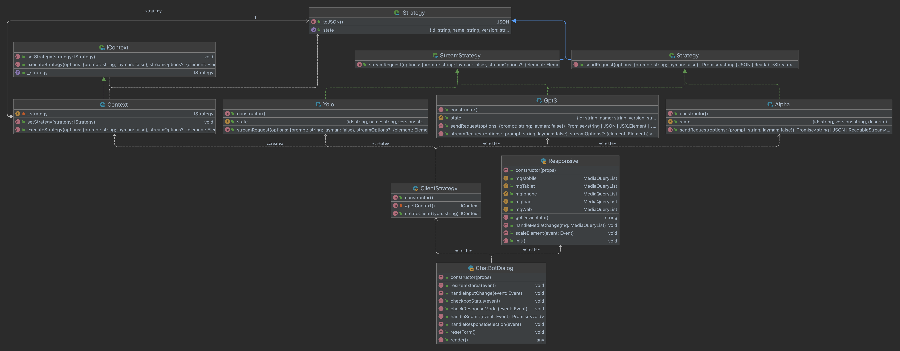

# Smart Scraper

This repository is a demo web scraper search engine powered by 
multiple AI engine APIs. Our approach here consist of using an AI 
Strategy pattern to aggregate all AI APIs within the Strategy to create 
a selection, pre-processing and post-processing pipeline utilizing the 
power of each APIs to query and validate before delivering the final result.

[GPT-3](https://chat.openai.com) has become the first of many AI models added 
to the factory. Next will be [wolframalpha](https://www.wolframalpha.com) and 
so on.

Our ambition it to build in phases and learn new ways to leverage the power of 
AI within each applicable domain. The use of logic models can 
help solve computation problems, though weak when it comes to natural language. 
A natural language model can help solve problems in the domain of language or linguistics. 
In this way we can extend the capabilities of our Scraper leveraging the power of AI.

Lastly, we have adopted [Cordova](https://github.com/dellius-alexander/Cordova-React-App.git) 
to help build a multiplatform architecture maintaining `one` code base.

---

##  Selecting a Design Pattern

Several design pattern would fulfill the initial use case of building a simple AI pipeline, 
but would fail to quickly adapt to changing business needs and market trends. Due to the behavior 
of trends and market shifts to different emerging technologies we were torn between `Chain of Responsibility` 
and the `Strategy Behavior Pattern`.

Chain of Responsibility (CoR)  splits responsibilities into multiple objects, allowing for easier development 
and maintenance, as well as better scalability. In the CoR design pattern, a request is sent through a chain 
of objects, each of which can handle the request or pass it to the next object in the chain. This allows for 
a more flexible and maintainable codebase, and helps to minimize the impact of changes. Since we will be 
implementating mostly external APIs and aggregating the responses the need for more fine grain controls are needed, 
with that in mind we chose the `Strategy Behavior Pattern`. 

The Strategy Behavior Pattern is similar to the Chain of 
Responsibility (CoR). However, instead of passing the response from one object to the next, the 
Strategy Behavior Pattern allows for more fine-grained control over how a particular request is responded to. 
The pattern defines a set of algorithms or strategies that can be used to respond to a particular request, and 
then chooses the best strategy to use at run-time, allowing for more customization and flexibility. The Strategy 
Design Pattern is better for this business model, as it provides a way to select from a set of models, and allows 
the selection to vary depending on the `Context`. The Chain of Responsibility, on the other hand, is better 
suited for use cases where the request is passed through a chain of objects until one of them is able to handle 
the request. We can define a family of algorithms and models, as well as make them 
interchangeable. 

`Figure 1` is the initial implementation of the Strategy Behavior Pattern. We will be 
adding and updating as the project evolves.

---

Figure 1:`Initial Implementation Strategy`

---

---
