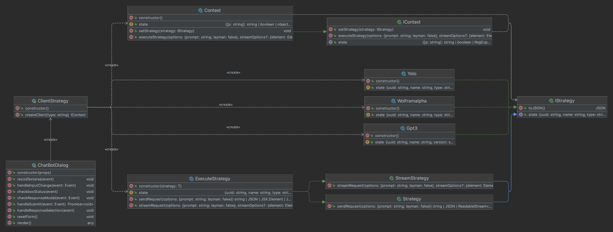

---

# Smart Scraper

Smart Scraper is an AI-driven web scraper search engine that uses multiple API engines 
to deliver results. It utilizes a Strategy Pattern to pre-process user requests, query 
API databases, and post-process results. Currently, the [GPT-3](https://chat.openai.com)  
API has been integrated, with WolframAlpha and other models to be added in the near future.

The goal of this project is to use Artificial Intelligence to extend the capability of 
the scraper and learn how to leverage the power of AI across different domains. For this 
purpose, [Cordova](https://github.com/dellius-alexander/Cordova-React-App.git)  is adopted 
to build a scalable, cross-platform architecture.

Selecting an appropriate design pattern is paramount in achieving the desired result. Chain 
of Responsibility (CoR), while useful to separate responsibility into smaller objects and 
make development and maintenance easier, cannot adapt quickly enough to changing business 
needs and market trends. Thus, the Strategy Behavior Pattern was selected instead.

This pattern allows for more fine-grained control over how a request is responded to. It 
defines a set of algorithms or strategies that can be used for responding to requests, and 
selects the most appropriate one at run-time. This is more suitable for scenarios where a 
family of algorithms and models may be utilized and swapped for each other on-the-fly.

Overall, Smart Scraper utilizes AI technologies to deliver intelligent search results that 
are more accurate and reliable. The use of a Strategy Design Pattern allows for customizable 
and flexible results that could be quickly adapted in response to changing business needs 
and market trends.

`Figure 1` is the initial implementation of the Strategy Behavior Pattern. We will be 
adding and updating as the project evolves.

***Note:[Click here for a detailed UML](docs/images/strategy-pattern-info.png)***

---

Figure 1:`Initial Implementation Strategy`

---

---
