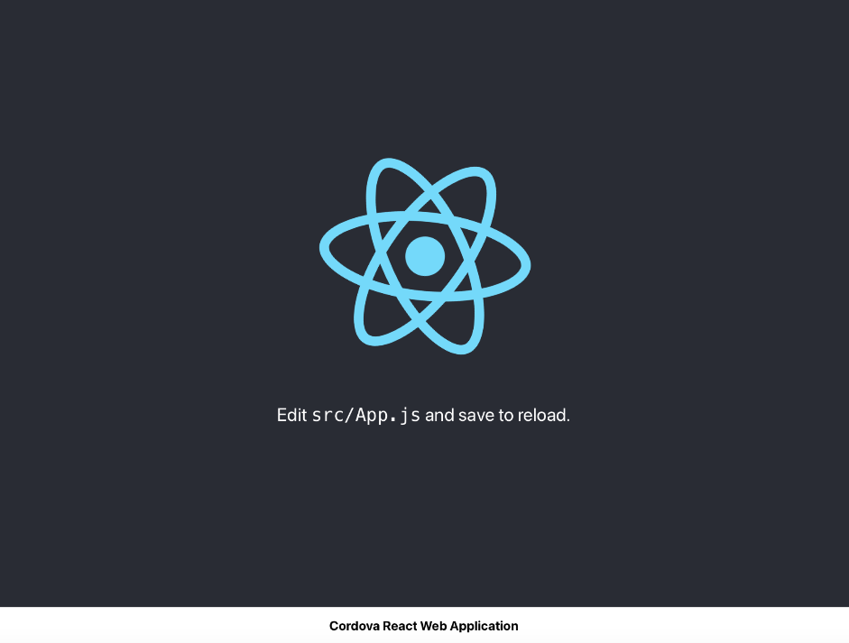
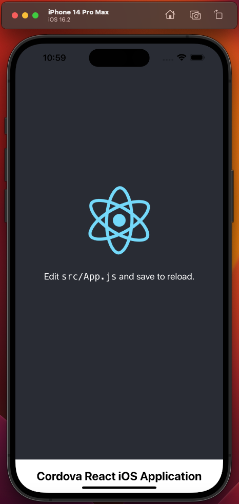
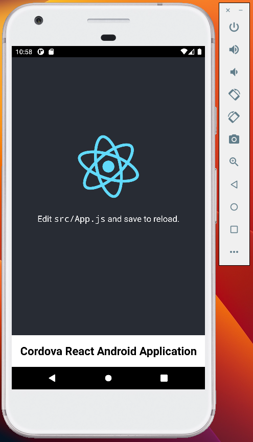

<h1 ><a href="#" id="title">Build a Cordova React App </a></h1>
<hr/>


Apache Cordova is a mobile application development framework that allows developers
to build native mobile apps using web technologies like HTML, CSS, and JavaScript.
Cordova provides a set of APIs that allow developers to access native device functionality,
such as the camera, GPS, and storage, from within their web-based code.

One of the main benefits of using Cordova is that it allows developers to build mobile
apps that can run on multiple platforms, including Android, iOS, and Windows, using the
same codebase. This can save a lot of time and resources, as it means that developers do
not have to create separate versions of the app for each platform.

Another benefit of Cordova is that it allows developers to leverage the vast ecosystem of
web technologies, tools, and libraries that are available for building web applications.
This can make it easier to build complex, feature-rich apps using a familiar set of tools.

On the downside, one potential drawback of Cordova is that the resulting apps may not
always feel as "native" as those built using platform-specific tools and languages. This
is because Cordova apps are essentially web applications that are running within a native
container, and may not always be able to take full advantage of all the native device
capabilities.

Another potential issue with Cordova is that it may not always be possible to achieve the
same level of performance as a native app, especially for more complex or resource-intensive
tasks. In these cases, a native app may be a better choice.

Overall, Cordova is a useful tool for building cross-platform mobile apps quickly and
efficiently, but it is not always the best choice for every situation. It is important
to carefully consider the specific needs and requirements of your project before deciding
whether to use Cordova or another mobile development framework.

Use Apache Cordova if you are:

- a mobile developer and want to extend an application across more than one platform,
  without having to re-implement it with each platform's language and tool set.

- a web developer and want to deploy a web app that's packaged for distribution in
  various app store portals.

- a mobile developer interested in mixing native application components with a WebView
  (special browser window) that can access device-level APIs, or if you want to develop
  a plugin interface between native and WebView components. Plugin interfaces gives you
  the ability to leverage native functionality such as camera, battery, in-app-browser and
  so much more. [See the plugin at https://cordova.apache.org/plugins/](https://cordova.apache.org/plugins/)


<hr/>

<h2 id="sample"><a href="#">Create Cordova React Application</a></h2>

1. First, install `Apache Cordova` using npm (Node Package Manager) and `create-react-app`:

    ```bash
    npm install -g cordova create-react-app
    ```
   - Run the following commands:

      ```bash
      # 1. create the react app first
      npx create-react-app cordova-react-app
      # 2. commit to git 
      git add . && git commit -m "initial commit"
      # 3. eject the app
      npm run eject
      ```

   This will create a `config/` directory in the root of your project.

2. We create the cordova app by running:

   ```bash
   # 4. create the cordova app from root directory enter
   cordova create cordovareactapp com.example.cordovareact CordovaApp
   ```

3. We move the `config.xml` from the cordovareact app to the root of the top level project.

4. Next we must edit the `buildPath` variable in the `config/paths.js` file to integrate with cordova.
Change the line where `const buildPath = process.env.BUILD_PATH || 'build'` to:

   ```javascript
   const buildPath = process.env.BUILD_PATH || 'www';
   ```

5. We add the field `"homepage": "./"` to the `package.json` file in the root of your project.

6. We goto `src/index.js` and add the following:

   ```javascript
   /**
    * Initialize the react app in no matter the platform
    */
   const initializeApp = () => {
       const root = ReactDOM.createRoot(document.getElementById('root'));
       root.render(
           <React.StrictMode>
               <App />
           </React.StrictMode>
       );
       // If you want to start measuring performance in your app, pass a function
       // to log results (for example: reportWebVitals(console.log))
       // or send to an analytics endpoint. Learn more: https://bit.ly/CRA-vitals
       reportWebVitals();
   }
   
   // if the device is ios or android use cordova,
   if (window.cordova) {
       // Wait for the deviceready event before using any of Cordova's device APIs.
   // See https://cordova.apache.org/docs/en/latest/cordova/events/events.html#deviceready
       document.addEventListener('deviceready', initializeApp, false);
   } else { // instead use the for regular browser web app
       initializeApp();
   }
   ```

7. We add the following to the `public/index.html` file. If this is a boilerplate code
you can copy the snippet below:

- What we did:
  - added and updated `Content-Security-Policy` meta tag.
    - added additional meta tags for:
       - `format-detection`
       - `msapplication-tap-highlight`
       - `viewport`

   ```html
   <!DOCTYPE html>
   <html lang="en">
   <head>
       <meta charset="utf-8" />
       <!--
          Customize this policy to fit your own app's needs. For more guidance, please refer to the docs:
              https://cordova.apache.org/docs/en/latest/
          Some notes:
              * https://ssl.gstatic.com is required only on Android and is needed for TalkBack to function properly
              * Disables use of inline scripts in order to mitigate risk of XSS vulnerabilities. To change this:
                  * Enable inline JS: add 'unsafe-inline' to default-src
          -->
       <meta
               http-equiv="Content-Security-Policy"
               content="default-src 'self' data: https://ssl.gstatic.com 'unsafe-inline' 'unsafe-eval'; style-src 'self' 'unsafe-inline'; media-src *; img-src 'self' data: content:;"
       />
       <meta name="format-detection" content="telephone=no" />
       <meta name="msapplication-tap-highlight" content="no" />
       <meta name="viewport" content="initial-scale=1, width=device-width, viewport-fit=cover" />
       <link rel="icon" href="%PUBLIC_URL%/favicon.ico" />
       <meta name="theme-color" content="#000000" />
       <meta
               name="description"
               content="Web site created using create-react-app"
       />
       <link rel="apple-touch-icon" href="%PUBLIC_URL%/logo192.png" />
       <!--
         manifest.json provides metadata used when your web app is installed on a
         user's mobile device or desktop. See https://developers.google.com/web/fundamentals/web-app-manifest/
       -->
       <link rel="manifest" href="%PUBLIC_URL%/manifest.json" />
       <!--
         Notice the use of %PUBLIC_URL% in the tags above.
         It will be replaced with the URL of the `public` folder during the build.
         Only files inside the `public` folder can be referenced from the HTML.
      
         Unlike "/favicon.ico" or "favicon.ico", "%PUBLIC_URL%/favicon.ico" will
         work correctly both with client-side routing and a non-root public URL.
         Learn how to configure a non-root public URL by running `npm run build`.
       -->
       <!-- Added to demonstrate merges -->
       <link rel="stylesheet" type="text/css"  src="./static/css/platform.css" />
      
       <!--    Tab title   -->
       <title>Cordova React App</title>
   </head>
   <body>
   <noscript>You need to enable JavaScript to run this app.</noscript>
   <div id="root"></div>
      
   <!--
     This HTML file is a template.
     If you open it directly in the browser, you will see an empty page.
      
     You can add webfonts, meta tags, or analytics to this file.
     The build step will place the bundled scripts into the <body> tag.
      
     To begin the development, run `npm start` or `yarn start`.
     To create a production bundle, use `npm run build` or `yarn build`.
   -->
      
   <script type="text/javascript" src="cordova.js"></script>
   <script type="text/javascript" src="./static/js/platform.js"></script>
      
   </body>
   </html>
   ```

8. Add the platforms you want to support (e.g. browser, iOS, Android):

    ```bash
    cordova platform add browser
    cordova platform add ios
    cordova platform add android
   ```

9. Build and run your Cordova project using the cordova run/emulate command:

   *Note: [See Android Emulator](android-emulator.md) to setup an `android virtual device`. 
We need this in order to run android correctly. Also, note that `cordova-plugin-device` is 
also a needed dependency to run mobile devices.*

    ```bash
    cordova build
    cordova run browser
    cordova emulate ios
   # Note: You must download android emulator in order to run android
    cordova emulate android
    ```
   
   ### [Click here for more details on how to setup the android emulator](android-emulator.md)

<hr/>

<h2 id="plugins"><a href="#">Add Plugins</a></h2>

You can modify the default generated app to take advantage of standard
web technologies, but for the app to access device-level features, you
need to add plugins.

A plugin exposes a Javascript API for native SDK functionality. Plugins
are typically hosted on npm, and you can search for them on the [plugin
search page](https://cordova.apache.org/plugins/). Some key APIs are
provided by the Apache Cordova open source project and these are referred
to as [Core Plugin APIs](https://cordova.apache.org/docs/en/11.x/guide/support/index.html#core-plugin-apis).

To add and save plugins to `package.json`, we use `cordova cli` to add plugins:

```bash
cordova plugin add \
  cordova-plugin-device \
  cordova-plugin-dialogs  \
  cordova-plugin-inappbrowser \
  cordova-plugin-webpack

Installing "cordova-plugin-device" for android
Installing "cordova-plugin-device" for browser
Installing "cordova-plugin-device" for ios
Adding cordova-plugin-device to package.json
Installing "cordova-plugin-dialogs" for android
Installing "cordova-plugin-dialogs" for browser
Installing "cordova-plugin-dialogs" for ios
Adding cordova-plugin-dialogs to package.json
Installing "cordova-plugin-inappbrowser" for android
Installing "cordova-plugin-inappbrowser" for browser
Installing "cordova-plugin-inappbrowser" for ios
Adding cordova-plugin-inappbrowser to package.json
Installing "cordova-plugin-webpack" for android
Installing "cordova-plugin-webpack" for browser
Installing "cordova-plugin-webpack" for ios
Adding cordova-plugin-webpack to package.json

```

Plugins can also be added using a directory or a git repo.

*NOTE: The CLI adds plugin code as appropriate for each platform. If you
want to develop with lower-level shell tools or platform SDKs as discussed
in the [Overview](https://cordova.apache.org/docs/en/11.x/guide/overview/index.html),
you need to run the Plugman utility to add plugins
separately for each platform. (For more information, see [Using Plugman to
Manage Plugins](https://cordova.apache.org/docs/en/11.x/plugin_ref/plugman.html).)*

Use `cordova` `plugin ls` (or `plugin list`, or `plugin` by itself) to view currently
installed plugins. Each displays by its identifier:

```bash
cordova plugin ls

cordova-plugin-device 2.1.0 "Device"
cordova-plugin-dialogs 2.0.2 "Notification"
cordova-plugin-inappbrowser 5.0.0 "InAppBrowser"
cordova-plugin-webpack 1.0.5 "Webpack"

```

If you want all page loads in your app to go through the InAppBrowser,
you can simply hook `window.open` during initialization. For example:


*Note: this is usually found in `src/index.js`*

```javascript
document.addEventListener("deviceready", onDeviceReady, false);
function onDeviceReady() {
    window.open = cordova.InAppBrowser.open;
}
```

<hr />

<h3 id="plugins"><a href="https://github.com/kotarella1110/cordova-plugin-webpack#features">Webpack Plugin</a></h3>

You can choose to install `Cordova Webpack Plugin` using npm install or
add the following to your `package.json` file.

```bash
npm install -D webpack@5 webpack-cli@5 webpack-dev-server@4;
cordova plugin add cordova-plugin-webpack;
```

You can use the Cordova Webpack plugin to automate this process by
specifying the path to your Webpack configuration file in the Cordova
configuration file `config.xml`. This will allow you to build and run
your Cordova app with a single command:

```bash
cordova run android --webpack
```

To specify the path to your Webpack configuration file in the Cordova
configuration file `config.xml`, you can add the following element to
your `config.xml` file:


```xml
<platform name="android">
  ...
  <webpack-config src="./config/webpack.config.js" />
  ...
</platform>
```

This tells Cordova to use the Webpack configuration file located at
`webpack.config.js` when building the Android version of your Cordova app.

[Config.xml configuration file options can be found on Cordova documentation site](https://cordova.apache.org/docs/en/11.x/config_ref/index.html)

You can also specify a different Webpack configuration file for each
platform by using the `name` attribute:

```xml
<?xml version="1.0" encoding="utf-8" ?>
<widget
        id="com.example.appName"
        version="1.0.0"
        xmlns="http://www.w3.org/ns/widgets"
        xmlns:cdv="http://cordova.apache.org/ns/1.0"
>
    ...
    <platform name="android">
        ...
        <webpack-config src="./config/webpack.android.config.js" />
        ...
    </platform>
    ...
    <platform name="ios">
        ...
        <webpack-config src="./config/webpack.ios.config.js" />
        ...
    </platform>
    ...
</widget>
```

This will use the `webpack.android.config.js` file when building the Android
version of the app, and the `webpack.ios.config.js` file when building the iOS
version of the app.

Once you have specified the path to your Webpack configuration file in `config.xml`,
you can build and run your Cordova app with Webpack by using the following command:

```bash
cordova run browser --webpack
cordova run android --webpack
```

Checkout the repository for the [Cordova-Plugin-Webpack](https://github.com/kotarella1110/cordova-plugin-webpack#features)
for more information and customizations.

<hr />

<h2 id="plugins"><a href="https://moduscreate.com/blog/cross-platform-cordova-app-development-with-merges">Working with Merges</a></h2>

`Merges` help to create `modularity` and `extensibility` to your application. It provides the flexibility
to create platform specific specifying our app's look, feel and behavior on a per-platform basis,
without polluting the app's `single JavaScript codebase`.

You can add platforms, such as iOS, Windows, Electron and Android platform specific files. To use merges
we do:

1. `Create a merges directory structure`: create a new directory called `merges` in the root of your Cordova
   project. This directory will be used to store platform-specific files that will be merged into your
   project at build time.
2. `Create platform-specific directories`: Within the `merges` directory, create a subdirectory for each
   platform that you are targeting. For example, if you are targeting Android and iOS, you would create
   the following directories:

   ```bash
   mkdir -p merges/{android,ios,browser}/static/{css,img,js}
   mkdir -p merges/android/res/{layout,xml,icon}
   ```

3. Add platform-specific files: Within each platform-specific directory, add any files that you
   want to include in your project when building for that particular platform.

    - Here is an example of how you might use the "merges" feature to include platform-specific icons in
      your Cordova project:

       ```markdown
       - my-project/
           - merges/
               - android/
                   - static/
                       - css/
                            platform.css
                       - img/
                       - js/
                            platform.js
                   - res/
                       - layout/
                       - xml/  
                       - icon/
                           icon.png
               - ios/
                   - static/
                       - css/
                            platform.css
                       - img/
                       - js/
                            platform.js
               - browser/
                   - static/
                       - css/
                            platform.css
                       - img/
                       - js/
                            platform.js
       - www/
          - index.html
          - css/
          - js/
       - config.xml
       - package.json
       ```

   In this example, the `merges/android/res/icon/icon.png` file would be merged into the
   `platforms/android/app/src/main/res/icon/icon.png` directory when building the Android version of
   the app, and the `merges/ios/static/js/platform.js` file would be merged into the
   `platforms/ios/www/static/js/platform.js` directory when building the iOS version. This allows
   you to include platform-specific dependencies/changes in your project without having to maintain separate copies
   of all the same files for each platform.

4. Modify the `config.xml` file: In the root of your Cordova project, open the `config.xml`
   file and add the following line to each platform configuration:

   ```xml
   <?xml version="1.0" encoding="utf-8" ?>
   <widget
        id="com.example.appName"
        version="1.0.0"
        xmlns="http://www.w3.org/ns/widgets"
        xmlns:cdv="http://cordova.apache.org/ns/1.0"
   >
   
   <!--    Android Platform    -->
   <platform name="android">
        <!-- Required to set minSdkVersion  -->
        <preference name="android-minSdkVersion" value="29" />
        <!-- Required to set targetSdkVersion  -->
        <preference name="android-targetSdkVersion" value="31" />
        <edit-config
                file="AndroidManifest.xml"
                mode="merge"
                target="/manifest/application" >
            <application android:usesCleartextTraffic="true" />
        </edit-config>
        ...
        <webpack-config src="./config/webpack.config.js" />
        <resource-file src="merges/android/static" target="app/src/main/assets/www/static" />
        <resource-file src="merges/android/res" target="app/src/main/res" />    
        ...
   </platform>
   
   <!--    IOS Platform    -->
   <platform name="ios">
   <preference name="deployment-target" value="13.0.0" />
        <!--
        InAppBrowserStatusBarStyle [iOS only]: (string, options 'lightcontent',
        'darkcontent' or 'default'. Defaults to 'default') set text color style for iOS.
        'lightcontent' is intended for use on dark backgrounds. 'darkcontent' is only
        available since iOS 13 and intended for use on light backgrounds.
        -->
        <preference name="InAppBrowserStatusBarStyle" value="lightcontent" />
        <!--
        Since the introduction of iPadOS 13, iPads try to adapt their content mode / user
        agent for the optimal browsing experience. This may result in iPads having their
        user agent set to Macintosh, making it hard to detect them as mobile devices using
        user agent string sniffing.
        -->
        <preference name="PreferredContentMode" value="mobile" />
        ...
        <webpack-config src="./config/webpack.config.js" />
        <resource-file src="merges/ios/*" target="www" />
        ...
   </platform>
   
    <!--    Browser Platform    -->
   <platform name="browser">
       ...
       <webpack-config src="./config/webpack.config.js" />
       <resource-file src="merges/browser/*" target="www" />
       ...
   </platform>
   ...
   </widget>
   ```

5. Lets `customize merges for Browser, Android and iOS platforms` to make sure our platform specific behavior
   will override the default Cordova application:

   ```text
   # Place your custom platform specific behavior for android in this directory
   merges/android/static/css/platform.css
   merges/android/static/js/platform.js
   merges/android/static/img/logo.png
    
   # Place your custom platform specific behavior for ios in this directory
   merges/ios/static/css/platforms.css
   merges/ios/static/js/platform.js
   merges/ios/static/img/logo.png
   
   # Place your custom platform specific behavior for browser in this directory
   merges/browser/static/css/platforms.css
   merges/browser/static/js/platform.js
   merges/browser/static/img/logo.png
   ```

    - Override the default platform specific styles behavior

       ```css
       /* This is Android merges/android/static/css/platform.css */
       .event.received {
       background-color:#FF0000;
       }
    
       /* This is iOS merges/ios/static/css/platform.css */
       .event.received {
       background-color:#0000FF;
       }
      
      /* This is Browser merges/browser/static/css/platform.css */
       .event.received {
       background-color:#0010FF;
       }
       ```   
   - Override the default platform specific javascript behavior

      ```javascript
      /* This is Android merges/android/static/js/index.js */
      // apply platform specific rules
      function platformConstants() {
      // platform specific rules
      return `<h2 >Cordova React Android Application</h2>`;
      }
   
      document.addEventListener("deviceready", () => {
      const element = document.createElement('div');
      element.style = 'text-align:center;';
      element.innerHTML = platformConstants();
      document.body.append(element);
      },
      false);

      
      /* This is iOS merges/ios/static/js/index.js */
      // apply platform specific rules
      function platformConstants() {
      // platform specific rules
      return `<h2 >Cordova React iOS Application</h2>`;
      }
   
      document.addEventListener("deviceready", () => {
      const element = document.createElement('div');
      element.style = 'text-align:center;';
      element.innerHTML = platformConstants();
      document.body.append(element);
      }, false);

      
     /* This is Browser merges/browser/static/js/index.js */
      // apply platform specific rules
      function platformConstants() {
      // platform specific rules
      return `<h2 >Cordova React Web Application</h2>`;
      }
   
      document.addEventListener("deviceready", () => {
      const element = document.createElement('div');
      element.style = 'text-align:center;';
      element.innerHTML = platformConstants();
      document.body.append(element);
      },
      false);

        ```

<hr />


Now our environment has been successfully created. We can now start developing our application.

Update your `package.json` script block to allow for easy startup:


```json
{
  "scripts": {
    "prestart": "echo NODE_ENV=development | npm run build; cordova build;",
    "start": "cordova run browser ios android --debug;",
    "start-browser": "echo NODE_ENV=development | npm run build; cordova run browser --debug;",
    "start-ios": "echo NODE_ENV=development | npm run build; cordova build ios; cordova emulate ios --debug;",
    "start-android": "echo 'NODE_ENV=development' | npm run build; cordova build android; cordova emulate android --debug;",
    "build": "echo NODE_ENV=development | node scripts/build.js",
    "test": "echo NODE_ENV=development | node scripts/test.js"
  }
}
```


Now run `npm run start-[platform]` to run individual platform: 

```bash
npm run start-browser
# make sure emulator is installed and running via xcode
npm run start-ios
# make sure emulator is installed and running
npm run start-android
```

---

Your boilerplate application should look like this:

<!-- Image Collection -->

<div style="text-align:center;">
    
    <br/>
    
    <br/>
    
    <br/>
</div>

---


